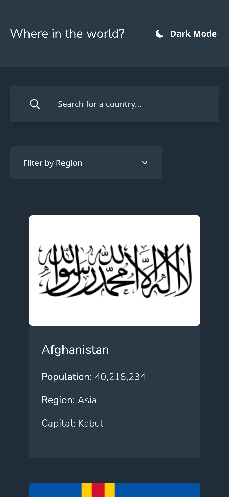
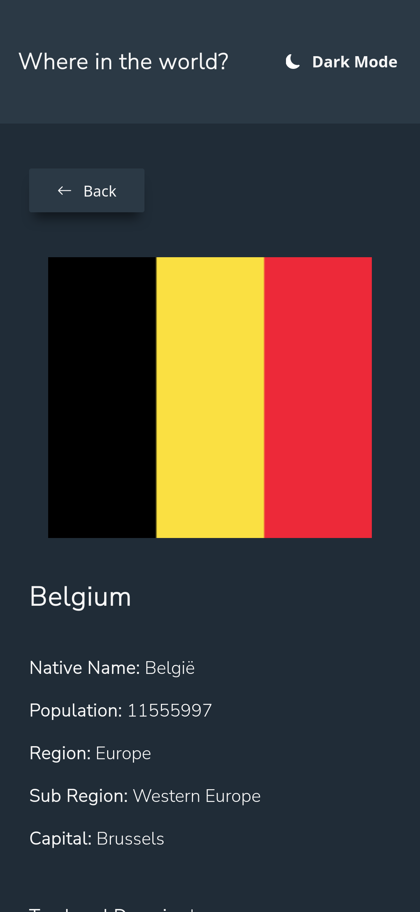
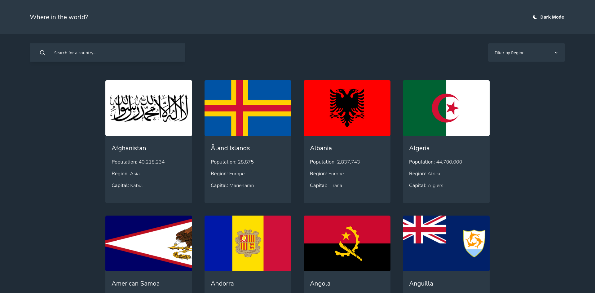

# Frontend Mentor - REST Countries API with color theme switcher solution

This is a solution to the [REST Countries API with color theme switcher challenge on Frontend Mentor](https://www.frontendmentor.io/challenges/rest-countries-api-with-color-theme-switcher-5cacc469fec04111f7b848ca). Frontend Mentor challenges help you improve your coding skills by building realistic projects. 

## Table of contents

- [Overview](#overview)
  - [The challenge](#the-challenge)
  - [Screenshot](#screenshot)
  - [Links](#links)
- [My process](#my-process)
  - [Built with](#built-with)
- [Author](#author)

## Overview

### The challenge

Users should be able to:

- See all countries from the API on the homepage
- Search for a country using an `input` field
- Filter countries by region
- Click on a country to see more detailed information on a separate page
- Click through to the border countries on the detail page
- Toggle the color scheme between light and dark mode *(optional)*

### Screenshot

  

    
    
  

  

    
  

### Links

- Solution URL: [https://github.com/Guille-Sanchez/countries-api](https://github.com/Guille-Sanchez/countries-api)
- Live Site URL: [https://countries-api-chicho.netlify.app/](https://countries-api-chicho.netlify.app/)

## My process

  I started this challenge considering the mockup data provided in the started package. By doing so, I needed to add types to the provided JSON. After that, I structured the page. First I finished the search and the filter method. Then I work on the rendering the flags in a mobile device. Once I completed this task, I work on the feature to toggle between dark-mode and light-mode. Once I finished that, I added the react-router-dom and work on the detailed page.

### Built with

- Semantic HTML5 markup
- CSS custom properties
- Flexbox
- CSS Grid
- Mobile-first workflow
- [React](https://reactjs.org/) - JS library
- [Typescript](https://www.typescriptlang.org/) - Strongly typed programming language that builds on JavaScript,

## Author

- Website - [My Porfolio](https://guillermo-portfolio.netlify.app/)
- Frontend Mentor - [@Guille-Sanchez](https://www.frontendmentor.io/profile/Guille-Sanchez)
- LinkedIn - [Guillermo Sanchez](https://www.linkedin.com/in/guillermo-sanchez-52a616268)
